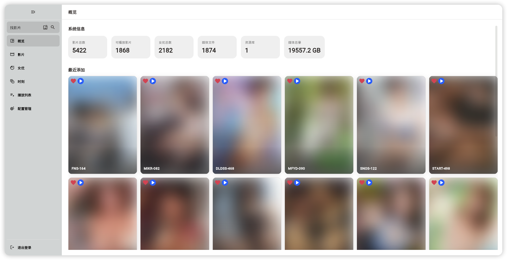
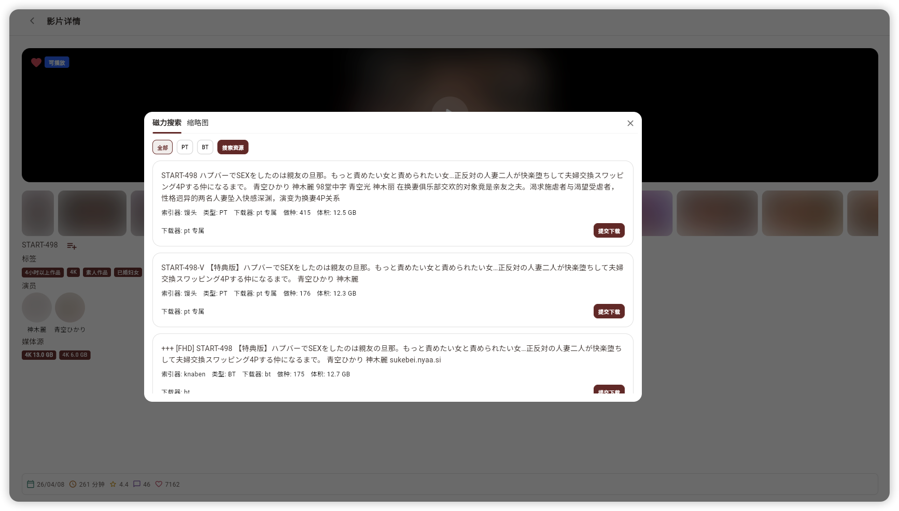

# SakuraMedia

SakuraMedia 是一个面向 NAS 用户的跨平台媒体管理前端项目，受 MoviePilot 启发，聚焦观影与自动化的核心需求，打造一站式观影中枢。

它希望把「找片、下片、查信息、看评论、查排行榜等这些高频动作尽量收敛到同一个界面里，集成了QB下载器、Jackett索引器、以及Javdb作为元数据来源。

一句话概括sakuramedia就是 Jav界的 Jellyfin + moviepilot，以及在观影层面上做了一点小巧思：**以图搜图**(用来查找相似的场景)和**时刻**(标记精彩部分方便回看)

## 产品概览

## 这个项目能帮你做什么

### 1. 把观影相关操作集中到一个工作台里

围绕 NAS 用户最常见的使用场景，把影片浏览、女优信息、搜索、配置管理等能力收敛到统一界面中，降低日常整理和查找媒体内容的门槛。

### 2. 围绕自动化链路做更顺手的前端体验

项目定位不是单纯的“媒体展示页”，而是面向自动化使用习惯设计的工作台前端。它会重点承载媒体检索、订阅协同、配置管理和后续自动化链路的可视化操作体验。

### 3. 同时支持 PC、Web 与移动端

SakuraMedia 使用 Flutter 构建，当前以桌面端体验为主，同时覆盖 Web 与移动端。PC 和 Web 适合承担完整工作台操作，移动端则更适合随时查看、检索和快速进入常用页面。

## 当前已落地的主要能力

基于当前仓库实现，已经稳定存在的主要页面与流程包括：

- 登录页
- 桌面端工作台壳层
- 概览页
- 影片列表页与影片详情页
- 女优列表页与女优详情页
- 配置管理页
- 桌面端搜索页
- 以图搜图/时刻界面

此外，仓库中也已经接入了桌面/Web 侧更多媒体页、榜单页、活动页，以及移动端的影片、女优、榜单等页面能力，但整体产品形态仍然以桌面工作台为主。

## 适合谁

- 已经在 NAS 上维护个人媒体库，希望有一个更顺手的统一前端
- 喜欢 MoviePilot 这类自动化思路，但希望观影、检索和管理体验更聚焦
- 希望一套系统同时覆盖 PC/Web 与手机使用场景

## 平台说明

- 桌面端：当前主体验平台，工作台壳层和主要管理流程优先围绕桌面端设计
- Web 端：复用桌面端路由与壳层，适合在浏览器中使用工作台能力
- 移动端：已接入基础导航与部分真实页面，适合做轻量浏览、搜索和快捷操作

## 快速开始

1. 先按后端部署文档完成服务部署与基础配置
2. 启动 SakuraMedia 客户端并连接后端地址
3. 登录后进入工作台，开始使用影片浏览、搜索与配置管理能力

Wiki 文档：
[SakuraMedia Wiki](https://tinypinglite.github.io/sakuramedia/)

## 项目入口

- 前端仓库：[tinypinglite/sakuramedia](https://github.com/tinypinglite/sakuramedia)
- 后端仓库：[tinypinglite/sakuramediabe](https://github.com/tinypinglite/sakuramediabe)
- Wiki 文档：[tinypinglite.github.io/sakuramedia](https://tinypinglite.github.io/sakuramedia/)

## 风险与声明

> 当前 SakuraMedia 仍处于持续迭代阶段，建议优先在测试环境或有完整备份的前提下使用。

- SakuraMedia 提供的是媒体管理、检索与工作台能力，不提供任何媒体资源内容。
- 请确保你的使用行为符合所在地法律法规与版权要求。
- License: [GNU GPL v3](./LICENSE)
