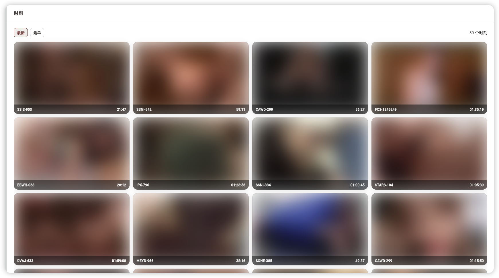

# SakuraMedia

SakuraMedia 是一个面向 NAS 用户的本地媒体管理工作台，让你在一个界面里完成整理、检索、订阅和回看。

## 产品总览

## 两大核心价值

### 1. 一站式管理与自动化获取

从本地媒体库管理，到在线搜索与订阅，再到影片资源自动化下载，整条链路在同一个工作台内完成，减少多工具来回切换。

### 2. 高效检索与更便捷观影

通过以图搜图与时刻功能快速定位内容；播放界面侧边栏支持影片内容预览，帮助你更快找到想看的片段并继续观看。支持标记精彩时刻，并通过时刻页面快速播放。

## 功能场景

- 统一管理本地媒体库与影片信息
- 在线搜索并订阅影片与女优
- 自动化下载与入库协同
- 以图搜图定位相关影片内容
- 使用时刻功能进行片段检索与回看
- 在播放界面侧边栏预览内容并快速跳转

## 平台支持说明

- 主力维护平台：`macOS`、`iOS`、`Android`
- 次级支持平台：`Web`、`Windows`
- 发布策略：`Web` 与 `Windows` 版本会随版本流程发版，但当前不做完整性测试

## 快速开始

这里不展开详细教程，请按以下顺序开始：

1. 按后端 Docker 部署文档完成服务部署与配置
2. 启动 SakuraMedia 客户端并连接后端地址
3. 完成首次基础配置后开始使用搜索、订阅与播放能力

完整教程请看：
[SakuraMediaBE Docker 部署文档](https://github.com/tinypinglite/sakuramediabe/blob/main/docs/deployment/docker.md)

## 文档入口

- 前端仓库：[tinypinglite/sakuramedia](https://github.com/tinypinglite/sakuramedia)
- 后端仓库：[tinypinglite/sakuramediabe](https://github.com/tinypinglite/sakuramediabe)
- 后端 Docker 部署教程：[docs/deployment/docker.md](https://github.com/tinypinglite/sakuramediabe/blob/main/docs/deployment/docker.md)

## 风险与声明

> ⚠️ 当前 SakuraMedia（前后端整体）仍处于实验性阶段，请先在测试环境或有完整备份的前提下使用。

- SakuraMedia 仅提供媒体管理与检索工作台能力，不提供任何媒体资源内容。
- 请确保你的使用行为符合所在地法律法规与版权要求。
- License: [GNU GPL v3](./LICENSE)
