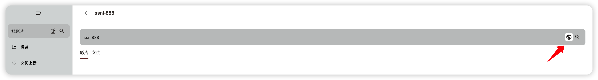

# 快速开始

这是一份"先把服务跑起来"的快速指引，覆盖 SakuraMedia 完整能力，包括「搜索 → 订阅 → 下载 → 导入」功能，以及以图搜图功能。

## 准备工作

#### 必备

- 一台24H 运行的主机/NAS，最好是 x86 架构， ARM 架构现已支持但尚未经过测试，可自行尝试。
- 已安装 `Docker` 和 `Docker Compose`
- 已在这台主机/NAS 上部署了 Torznab 索引器服务（如 Jackett / Prowlarr）和 `qBittorrent`
- 在这台主机/NAS 上准备一个媒体目录：SakuraMedia 之后自动下载的影片资源或者是手动导入的影片资源都会保存在这个目录下。

### 硬件要求

- CPU 建议 4 核，可用内存不少于 4G，运行`Joytag`推理服务以及`qdrant`向量数据量比较吃内存。
- 一个固态硬盘存储空间来放运行数据（数据库、配置文件、日志、影片元数据、图片索引数据等)。
- 一个机械硬盘存储空间用来存放媒体文件。


### 部署后会有 4 个服务

- `sakuramedia`：后端服务，负责媒体管理和任务调度等核心能力
- `postgres`：PostgreSQL 数据库，存储所有业务数据；照抄 compose 即可，无需任何数据库配置
- `joytag-infer`：以图搜图推理服务，负责图片向量化能力
- `qdrant`：图片搜索向量数据库，存储缩略图向量并提供检索


## 部署后端服务

### 1. 创建数据目录
准备一个目录，用于存放运行时数据和compose.yaml，假设是`/mnt/ssd/sakuramedia`:
创建一个存放容器运行时数据的目录，包括了数据库、配置文件、日志、缓存、图片索引数据等。这个目录建议放在固态硬盘上，以保证服务的响应速度和稳定性。


```bash
cd /mnt/ssd/sakuramedia
mkdir -p sakuramedia-data/{cache,logs,config,joytag,media-clips,image-search-index,postgres,plugins} sakuramedia-data/cache/{assets,gfriends}
```


### 2. 准备joytag 推理模型
推理模型下载到`sakuramedia-data/joytag/model_vit_768.onnx`, 你可以不用wget，也可以用其他方式下载，放到`sakuramedia-data/joytag/model_vit_768.onnx`就可以了。
```bash
cd sakuramedia-data/joytag
wget -O model_vit_768.onnx https://github.com/tinypinglite/sakuramediabe/releases/download/model/model_vit_768.onnx
```


### 3. 准备 `compose.yaml`

#### 媒体目录怎么挂才能正确硬链接

> 这一步是整个部署里最容易踩坑、又最难当场发现问题的地方，建议挂之前先读一遍。

导入已有媒体、以及下载完成后的自动导入，默认都用「**硬链接**」把文件落进媒体库：同一份文件同时出现在原目录和媒体库里，**不额外占空间、瞬间完成**，下载的种子也能继续做种。

但硬链接有两个硬性前提：

1. **源和目标在同一块盘上**
   已有影片目录、qBittorrent 下载目录、媒体库目录，必须都在**同一块物理盘 / 同一个文件系统**上。跨盘是没法硬链接的。

2. **在容器里整体挂成一个目录**
   在 `compose.yaml` 里，要把上面这几类目录的**共同父目录作为一个整体挂进容器（一个 volume）**，不要把下载目录和媒体目录拆成两个独立挂载。另外**容器内路径必须以 `/mnt` 开头**（导入界面的目录浏览只从 `/mnt` 往下看，挂到别处就选不到）。


**推荐的目录布局**：把媒体根目录 假设是`/mnt/volume1/media` 整体挂进容器，下面再分三个子目录：

```text
/mnt/volume1/media        ← 整体挂进容器的就是这一个目录
├── av                    ← 已有影片目录
├── downloads             ← qBittorrent 下载目录
└── sakuramedia           ← 新建的媒体库目录 之后导入和下载后导入的影片都会在这里
```

对应的 volume 写法（建议宿主机路径和容器路径写成一样，省得后面创建媒体库、填下载器路径时再做一次脑内换算）：

```yaml
    volumes:
      - ./sakuramedia-data:/data
      # 媒体根目录整体挂一个 volume；容器内路径以 /mnt 开头
      - /mnt/volume1/media:/mnt/volume1/media
```

挂对之后，两个场景就都能走硬链接：

- **导入已有媒体**：`av` 和 `sakuramedia` 在同一块盘、同一个挂载根下 → 导入瞬间完成、不额外占空间。
- **下载完成自动导入**：`downloads` 和 `sakuramedia` 在同一块盘、同一个挂载根下；再配合后面「添加 qBittorrent 下载器」一步把保存路径和本地访问路径对上（指向同一批真实文件），下载完就能自动硬链接进媒体库。

> 多块媒体盘怎么规划（每块盘一套媒体库 + 一套下载器），见[进阶部署 → 推荐部署思路](/guide/docker#推荐部署思路)。

#### 最小可用示例

在`/mnt/ssd/sakuramedia`里创建 `compose.yaml`

```bash
cd /mnt/ssd/sakuramedia
touch compose.yaml
```

填入以下内容:

```yaml
services:
  postgres:
    # 服务名必须保持 postgres，后端默认按这个主机名连接数据库，照抄即可零配置
    image: postgres:16-alpine
    container_name: sakuramedia-postgres
    restart: unless-stopped
    environment:
      POSTGRES_DB: sakuramedia
      POSTGRES_USER: sakuramedia
      POSTGRES_PASSWORD: sakuramedia
    volumes:
      # 数据库数据目录，务必放 SSD
      - ./sakuramedia-data/postgres:/var/lib/postgresql/data
    healthcheck:
      test: ["CMD-SHELL", "pg_isready -U sakuramedia -d sakuramedia"]
      interval: 10s
      timeout: 5s
      retries: 10

  sakuramedia:
    image: tinyping/sakuramediabe:latest
    container_name: sakuramedia
    restart: unless-stopped
    depends_on:
      postgres:
        condition: service_healthy
    ports:
      - "38000:8000" # API服务端口
    environment:
      # 如果你知道 PUID/PGID 的含义，可用 `id -u` 和 `id -g` 查询
      # 如果你不懂，就保持默认 0/0（root）
      PUID: 0
      PGID: 0
      TZ: "Asia/Shanghai"
      # 可选：JavDB / GFriends 等外部站点需要走代理时，取消注释并按需修改
      # HTTP_PROXY: "http://192.168.1.1:7890"
      # HTTPS_PROXY: "http://192.168.1.1:7890"
      # NO_PROXY: "localhost,127.0.0.1"
    volumes:
      # SakuraMedia 的运行数据都在 /data 下，整体挂一个目录即可
      - ./sakuramedia-data:/data
      # 挂载媒体目录，要挂载 已有影片目录和 qbittorrent下载目录 的共同父目录
      # 另外挂载到容器中的路径必须以 /mnt 开头，否则会影响导入已有媒体功能
      - 你宿主机的路径:/mnt/volume1/media

  joytag-infer:
    image: tinyping/joytag-infer:cpu
    container_name: joytag-infer # 不要改名
    restart: unless-stopped
    environment:
      JOYTAG_INFER_BACKEND: "cpu"
      JOYTAG_INFER_MODEL_PATH: "/data/lib/joytag/model_vit_768.onnx"
      JOYTAG_INFER_API_KEY: ""
    volumes:
      - ./sakuramedia-data/joytag:/data/lib/joytag


  qdrant:
    image: qdrant/qdrant:v1.12.4
    container_name: qdrant # 不要改名
    restart: unless-stopped
    environment:
      QDRANT__SERVICE__HTTP_PORT: "6333"
      QDRANT__LOG_LEVEL: "INFO"
    volumes:
      # 图片搜索向量库存储；务必放 SSD
      - ./sakuramedia-data/image-search-index:/qdrant/storage
    ulimits:
      # 向量库基于 RocksDB，写入/优化时同时打开大量段文件，默认 1024 不够会报 Too many open files
      nofile:
        soft: 65536
        hard: 65536

```

::: tip 数据库无需任何配置
后端默认就按 `postgres` 这个服务名连接内置的 PostgreSQL，账号密码也和上面 compose 里的默认值对齐，**照抄就能跑，不用改任何数据库配置**。

`postgres` 服务没有对宿主机映射端口，只在 compose 内部网络可见，外部无法直接访问。只有当你想用自己已有的 PostgreSQL 时，才需要去 `config.toml` 里改 `[database].url`（见[配置说明](/guide/config#database)）。
:::
### 4. 启动
运行 `docker compose up -d` 启动服务。

```bash
docker compose up -d
```

### 5. 访问

默认用户名和密码是`account` 和 `account`，登录后建议第一时间修改密码。

#### 桌面端 / 移动端 APP

桌面端和移动端 APP 在首次登录界面需要填写「服务器地址」，这里要填的是**后端 API 服务地址**，也就是 `compose.yaml` 里 `sakuramedia` 容器对外暴露的端口（默认 `38000`）：

```text
http://你的IP:38000
```

### 6. 首次登录后的最小初始化

服务启动后，建议按这个顺序完成最小初始化。


#### 1. 创建媒体库

登录后先进入配置页面，创建一个新的媒体库，假设你挂载到容器里的媒体目录是`/mnt/volume1/media`，新建媒体库根目录这里按上文的约定填写`/mnt/volume1/media/sakuramedia`


#### 2. 添加 qBittorrent 下载器

假设你qBittorrent的下载目录是挂载到容器中的`/mnt/volume1/media/downloads`，在qBittorent容器这个目录是 `/downloads`，那么在添加下载器的时候：
* qBittorrent保存路径填写：`/downloads`
* 本地访问路径填写：`/mnt/volume1/media/downloads`

这里一定要注意：

- qBittorrent保存路径 填的是 `qBittorrent` 容器里实际看到的下载路径
- 本地访问路径 填的是 `SakuraMedia` 容器里的实际看到的下载路径
- 这两个路径在宿主机上，实际指向的是同一个目录

如果这里填错了，后续下载任务虽然可能能提交成功，但 SakuraMedia 没法正确识别和导入下载结果。

目标媒体库直接选择你刚刚创建的那个媒体库即可。

::: tip
如果你打算按类别隔离下载任务（例如把不同类型的索引器接到不同下载器上），可以部署多个 qBittorrent 实例，并在 SakuraMedia 里各建一个下载器。
:::


#### 3. 配置索引器（Torznab）

1. 新建索引器
  - 名称：随意
  - Torznab 地址：索引器搜索接口地址（如 Jackett / Prowlarr 提供的 torznab 端点）
  - API Key（可选）：每个索引器独立配置；留空则请求不携带 apikey，适合免鉴权服务
  - 类别：建议如实填写，方便手动搜索资源时，展示资源所属类别
  - 绑定下载器: 决定此站点的种子会交由哪个下载器来处理.


这一步完成后，SakuraMedia 才能走完整的”搜索候选资源 -> 提交下载 -> 导入媒体库”链路。

#### 4. 用组件诊断验证配置

回到「概览」页，顶部有一条「组件诊断」横条，点「开始检测」会一键检测媒体库、下载器、索引器、JavDB 与 JoyTag 的连通性。

#### 5. 在线搜索影片或女优

服务刚启动时，数据库通常还是空的。这时候如果你直接搜索一部影片或一个女优，可能会看到“本地库中没有匹配内容”。

这是正常的，因为 SakuraMedia 默认是先从本地数据库里搜索，如果本地数据库里没有，你可以在搜索页里手动开启右侧的 `网络` 图标，这将从`javdb`中进行搜索.

示例界面如下：



联网搜索的作用是：

- 当本地库里没有这部影片或这个女优时，主动去在线源查询
- 查询成功后，把对应的影片或女优元数据自动写入本地库
- 下次再搜索同一部影片或同一个女优时，通常就不需要再手动开启 `联网`
